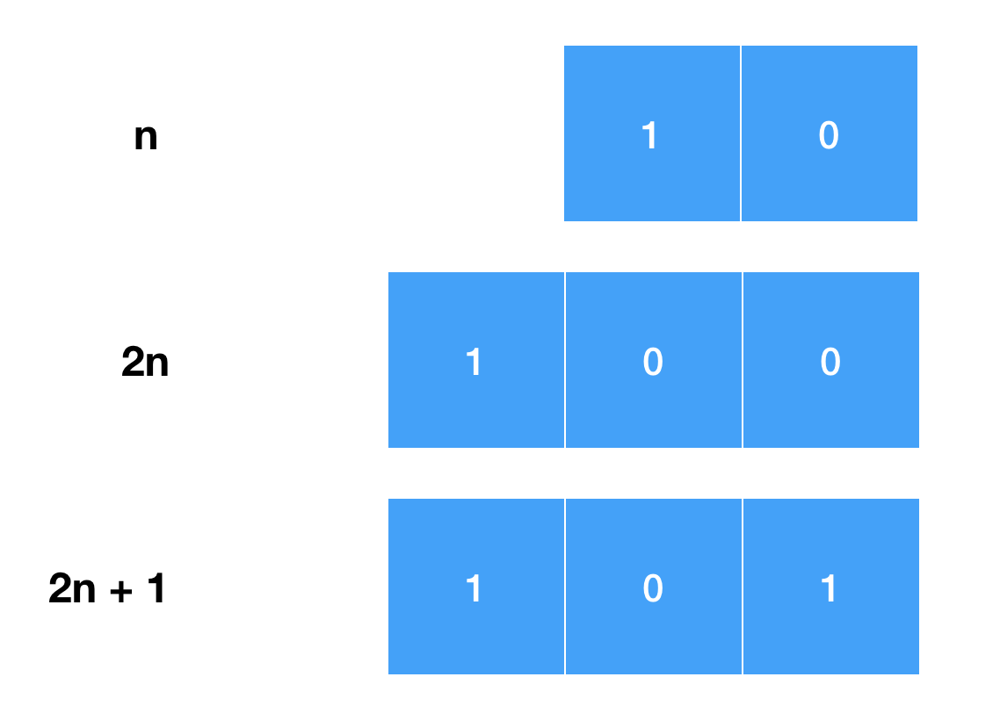

# 《剑指Offer：专项突破版》 - 整数部分 JavaScript 题解
《剑指Offer：专项突破版》是一个算法题集。该题单包含了程序员在准备面试过程中必备的数据结构与算法知识。 具体包含：
- 数据结构：整数、数组、字符串、链表、哈希表、栈、队列、树、堆和前缀树。
- 算法：二分查找、排序、回溯法、动态规划和图搜索。 

最近，把整数部分的题刷完了。本文来分享下这些题的解法~

[导图](./mind/num.mindnode)

## 题1 - [整数除法](https://leetcode-cn.com/problems/xoh6Oh/)
> 给定两个整数 a 和 b ，求它们的除法的商 a/b ，要求不得使用乘号 '\*'、除号 '/' 以及求余符号 '%'。

### 题解
最容易想到的算法是用减法来模拟除法。被除数减除数，直到被除数小于除数为止。核心代码如下：
```js
const times = 0;
while (left >= right) {
    left -= right;
    times++;
}
```

该算法存在性能问题。当被除数很大但除数很小时，减法操作执行的次数会很多。

改进算法如下：
探测除数是否大于除数的2倍。如果是，则继续判断被除数是否大于除数的4倍、8倍...2n倍，直到被除数大于被除数。此时，将被除数减去除数的 2n 倍，余数重复前面的步骤。被除数是15，除数是2时，用该算法来解如下图所示：


代码实现如下：
```js
let times = 0;
let rest = left;
while (rest >= right) {
let res = getMaxTimes(rest, right);
rest = res.rest;
times += res.times;
}

function getMaxTimes(left, right) {
  let times = 1;
  let prevRight = right;
  right += right;
  
  while (left >= right) {
    prevRight = right;
    right += right;
    times += times;
  }
  return {
    times,
    rest: left - prevRight,
  };
}
```

## 题2 - [二进制加法](https://leetcode-cn.com/problems/JFETK5/)
> 给定两个 01 字符串 a 和 b ，请计算它们的和，并以二进制字符串的形式输出。
> 输入为 非空 字符串且只包含数字 1 和 0。
### 解决方案
最容易想到的算法是将字符串转化出十进制的整数，求和后转化成二进制的字符串。实现如下：

```js
const addBinary = function (left, right) {
  const leftNum = parseInt(left, 2);
  const rightNum = parseInt(right, 2);
  const resNum = leftNum + rightNum;
  const resStr = resNum.toString(2);
  return resStr;
};
```

该算法存在的问题是：当求和的字符串足够大，转化成整数时会出现溢出。

要规避这种情况，可以将求和字符串右对齐，将每位相加。我这边将字符串转化成数组来处理。代码如下：
```js
const addBinary = function (left, right) {
  const leftArr = toNumberArr(left);
  const leftLen = leftArr.length;
  const rightArr = toNumberArr(right);
  const rightLen = rightArr.length;
  const maxLen = Math.max(leftLen, rightLen);

  const sumArr = [];

  // 是否进位
  let isCarry = false;
  for (let i = 1; i <= maxLen; i++) {
    const res = add(leftArr[leftLen - i], rightArr[rightLen - i], isCarry);
    sumArr[maxLen - i] = res.sum;
    isCarry = res.isCarry;
  }
  const tempSum = sumArr.join('');
  const sum = isCarry ? `1${tempSum}` : tempSum;
  return sum;
};

/*
 * 一位的运算
 */
function add(left, right, isCarry) {
  const sum = (left || 0) + (right || 0) + (isCarry ? 1 : 0);
  if (sum > 1) {
    return {
      sum: sum - 2,
      isCarry: true,
    };
  }
  return {
    sum,
    isCarry: false,
  };
}

function toNumberArr(str) {
  return str.split('').map((item) => parseInt(item, 10));
}
```

## 题3 - [前 n 个数字二进制中 1 的个数](https://leetcode-cn.com/problems/w3tCBm/)
> 给定一个非负整数 n ，请计算 0 到 n 之间的每个数字的二进制表示中 1 的个数，并输出一个数组。
### 解决方案
暴力解法是遍历所有数字，一个个算。但这样有效率问题。

可以根据偶数奇数的二进制的特点来高效的解决该问题。n 左移动一位，就变成了偶数 2n。因此，偶数 2n 和 n 的二进制中的 1 的个数相同。n 左移动一位再加1，就变成了奇数 2n + 1。因此，奇数 2n + 1 比 n 的二进制中的 1 的个数多1。如下图所示：


综上，知道 1 的二进制中 1 的个数，就能知道其他数字二进制中 1 的个数。实现：
```js
const countBits = function (n) {
  if (n === 0) {
    return [0];
  }
  if (n === 1) {
    return [0, 1];
  }
  const res = [0, 1];
  for (let i = 2; i <= n; i++) {
    if (i % 2 === 0) {
      res[i] = res[i / 2];
    } else {
      res[i] = res[(i - 1) / 2] + 1;
    }
  }
  return res;
};
```

## 题4 - [只出现一次的数字](https://leetcode-cn.com/problems/WGki4K/)
> 给你一个整数数组 nums ，除某个元素仅出现 一次 外，其余每个元素都恰出现 三次 。请你找出并返回那个只出现了一次的元素。

### 解决方案
最容易想到的算法是计算数组中所有数字出现的次数。然后，筛选出只出现一次的。

也可以用二进制的方法解决该问题。具体算法：  
1. 将数组中所有数字转化成二进制。
2. 每位求和，除以3。
3. 结果就是只出现一次的数字的二进制。

要注意的是，可能会存在负数。我这边是把负数全部转化成正数。最后找到的正数去原数组里找，如果只存在一次，则为正数，否则返回负数。

实现如下：
```js
const singleNumber = function (nums) {
  const positiveNum = nums.map((num) => Math.abs(num));
  const maxBitLen = Math.max(...positiveNum).toString(2).length;
  const binaryStrArr = positiveNum.map((num) => num.toString(2));
  const binarySumArr = [];
  for (let i = 1; i <= maxBitLen; i++) {
    binarySumArr[maxBitLen - i] = 0;
    binaryStrArr.forEach((numStr) => {
      binarySumArr[maxBitLen - i] += parseInt(
        numStr.charAt(numStr.length - i) || 0,
        10
      );
    });
  }
  const resBitArr = binarySumArr.map((num) => parseInt(num, 10) % 3);
  const res = parseInt(resBitArr.join(''), 2);
  const isResPositive = nums.filter((num) => num === res).length === 1;

  return isResPositive ? res : -res;
};
```

## 题5 - [单词长度的最大乘积](https://leetcode-cn.com/problems/aseY1I/)
> 给定一个字符串数组 words，请计算当两个字符串 words[i] 和 words[j] 不包含相同字符时，它们长度的乘积的最大值。假设字符串中只包含英语的小写字母。如果没有不包含相同字符的一对字符串，返回 0。

### 解决方案
比较两个字符串是否相同，最先想到的是将第一个字符串中所有的字母在第二个字符串中找一遍。找不到则表示两个字符串相同。

另一种方式是将字符的查找问题转化成数学问题。具体算法：  
1. 用一位是1其他位数是0的二进制来表示一个不同的字母。比如 a 是 1, b 是 10, c 是 100。
2. 去掉单词内相同的字母。
3. 将单词包含的字母表示的二进制数求和。
4. 单词之间做 & 操作，结果为0，则表示没有相同的字母。

实现如下：
```js
const maxProduct = function (words) {
  const lettersArr = 'abcdefghijklmnopqrstuvwxyz'.split('');
  const lettersValue = {};
  for (let i = 0; i < 26; i++) {
    lettersValue[lettersArr[i]] = 1 << i;
  }

  // 单词内的字母去重
  const uniqCharWords = words.map((word) => uniq(word));
  const wordsSum = uniqCharWords.map((word) => {
    return getSum(word, lettersValue);
  });

  let max = 0;
  for (i = 0; i < words.length; i++) {
    for (let j = i + 1; j < words.length; j++) {
      if ((wordsSum[i] & wordsSum[j]) === 0) {
        // 两个单词没有相同的字符
        const value = words[i].length * words[j].length;
        if (value > max) {
          max = value;
        }
      }
    }
  }
  return max;
};

function uniq(word) {
  const res = [];
  const cache = {};
  word.split('').forEach((c) => {
    if (cache[c]) {
      return;
    }
    cache[c] = true;
    res.push(c);
  });
  return res.join('');
}

function getSum(word, lettersValue) {
  return word.split('').reduce((prev, curr) => prev + lettersValue[curr], 0);
}
```
