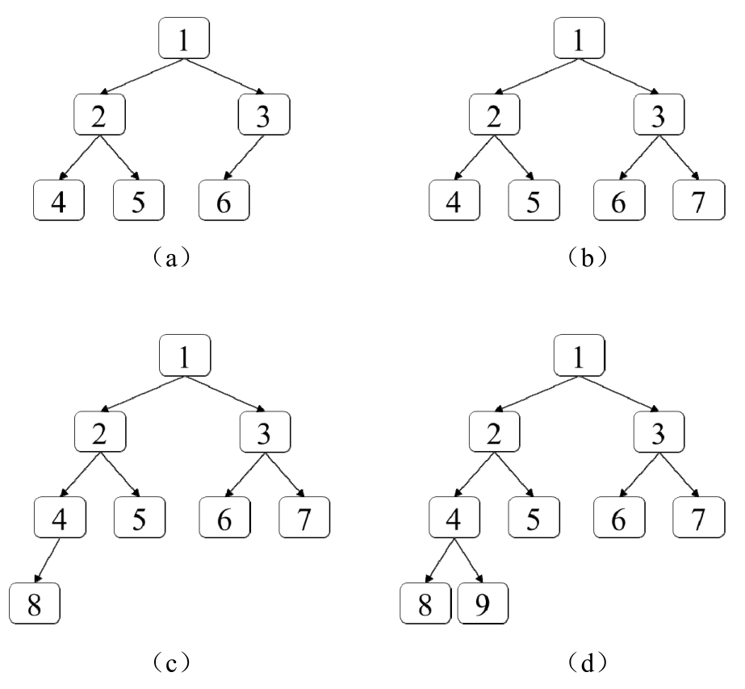
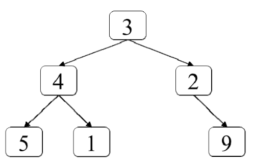
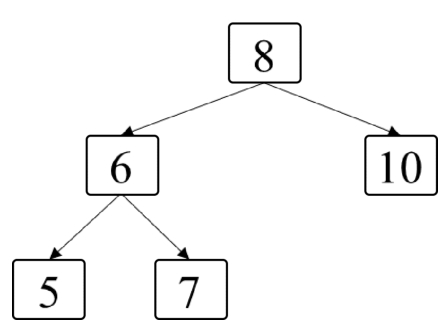

# 《剑指Offer：专项突破版》 - 队列部分 JavaScript 题解
《剑指Offer：专项突破版》是一个算法题集。该题单包含了程序员在准备面试过程中必备的数据结构与算法知识。具体包含：
- 数据结构：整数、数组、字符串、链表、栈、栈、队列、树、堆和前缀树。
- 算法：二分查找、排序、回溯法、动态规划和图搜索。 

本文来分享下队列部分题的解法~

## 队列介绍


## 题1 - 剑指 Offer II 041. 滑动窗口的平均值
> 题目：请实现如下类型MovingAverage，计算滑动窗口中所有数字的平均值，该类型构造函数的参数确定滑动窗口的大小，每次调用成员函数next时都会在滑动窗口中添加一个整数，并返回滑动窗口中所有数字的平均值。

[题的力扣地址](https://leetcode-cn.com/problems/qIsx9U/)

代码如下：

```js
```

## 题2 - 剑指 Offer II 042. 最近请求次数
> 题目：请实现如下类型RecentCounter，它是统计过去3000ms内的请求次数的计数器。该类型的构造函数RecentCounter初始化计数器，请求数初始化为0；函数ping（int t）在时间t添加一个新请求（t表示以毫秒为单位的时间），并返回过去3000ms内（时间范围为[t-3000，t]）发生的所有请求数。假设每次调用函数ping的参数t都比之前调用的参数值大。

[题的力扣地址](https://leetcode-cn.com/problems/H8086Q/)

代码如下：

```js
```

## 题3 - 剑指 Offer II 043. 往完全二叉树添加节点
> 题目：在完全二叉树中，除最后一层之外其他层的节点都是满的（第n层有2n-1个节点）。最后一层的节点可能不满，该层所有的节点尽可能向左边靠拢。例如，图7.3中的4棵二叉树均为完全二叉树。实现数据结构CBTInserter有如下3种方法。  
> ● 构造函数CBTInserter（TreeNode root），用一棵完全二叉树的根节点初始化该数据结构。
> ● 函数insert（int v）在完全二叉树中添加一个值为v的节点，并返回被插入节点的父节点。例如，在下图a所示的完全二叉树中添加一个值为7的节点之后，二叉树下图b所示，并返回节点3。在下图b所示的完全二叉树中添加一个值为8的节点之后，二叉树下图c所示，并返回节点4。在下图c所示的完全二叉树中添加节点9会得到下图d所示的二叉树并返回节点4。
> ● 函数get_root()返回完全二叉树的根节点。



[题的力扣地址](https://leetcode-cn.com/problems/NaqhDT/)

代码如下：

```js
```

## 题4 - 剑指 Offer II 044. 二叉树每层的最大值
> 题目：输入一棵二叉树，请找出二叉树中每层的最大值。例如，输下图的二叉树，返回各层节点的最大值[3，4，9]。



[题的力扣地址](https://leetcode-cn.com/problems/hPov7L/)

代码如下：

```js
```

## 题5 - 剑指 Offer II 045. 二叉树最底层最左边的值
> 题目：如何在一棵二叉树中找出它最低层最左边节点的值？假设二叉树中最少有一个节点。

[题的力扣地址](https://leetcode-cn.com/problems/LwUNpT/)

代码如下：

```js
```

## 题6 - 剑指 Offer II 046. 二叉树的右侧视图
> 题目：给定一棵二叉树，如果站在该二叉树的右侧，那么从上到下看到的节点构成二叉树的右侧视图。例如，下图中二叉树的右侧视图包含节点8、节点10和节点7。请写一个函数返回二叉树的右侧视图节点的值。



[题的力扣地址](https://leetcode-cn.com/problems/WNC0Lk/)

代码如下：

```js
```

## 相关阅读
* [《剑指Offer：专项突破版》 - 哈希表部分 JavaScript 题解](https://mp.weixin.qq.com/s/o57JvPCih3YT2cOxvPTSvw)
* [《剑指Offer：专项突破版》 - 链表部分 JavaScript 题解](https://mp.weixin.qq.com/s/IOA1cOa38c4DHcANcQgSKA)
* [《剑指Offer：专项突破版》 - 数组部分 JavaScript 题解](https://mp.weixin.qq.com/s/gU9gDo60IWbuBmoeX4a3gA)
* [《剑指Offer：专项突破版》 - 字符串部分 JavaScript 题解](https://mp.weixin.qq.com/s/aD4sEREM50EF294Mnt7xrw)
* [《剑指Offer：专项突破版》 - 整数部分 JavaScript 题解](https://mp.weixin.qq.com/s/E9wxw1ahtBeCAE_njmIr2Q)