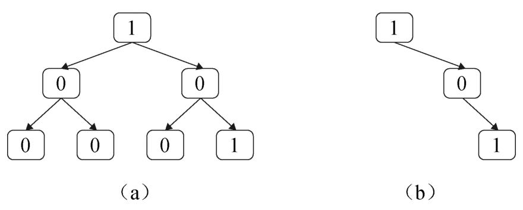
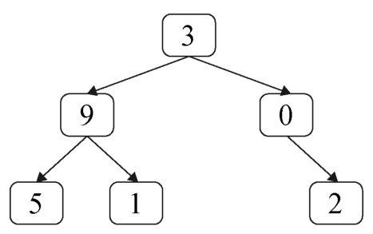
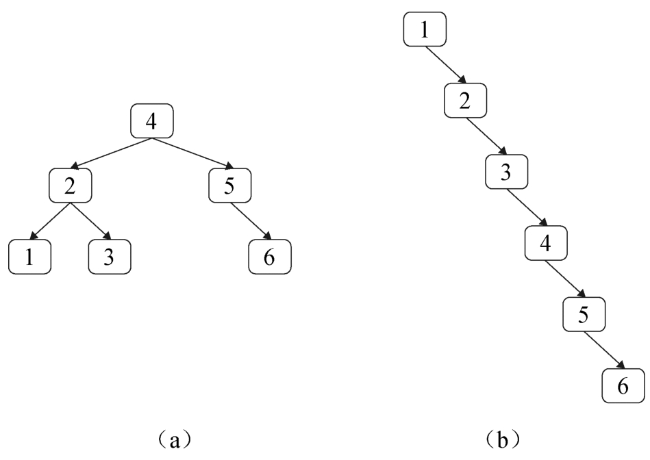
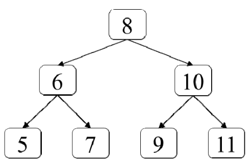
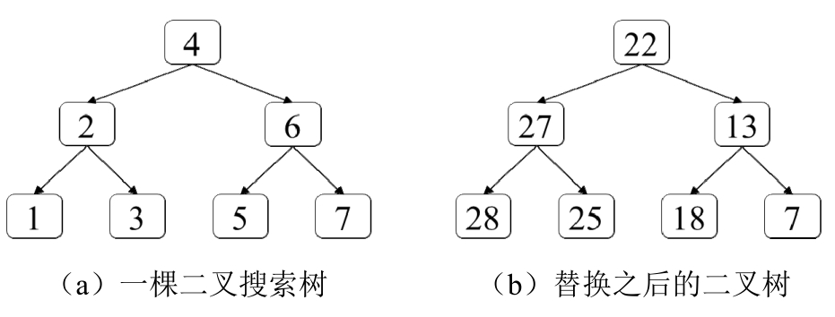
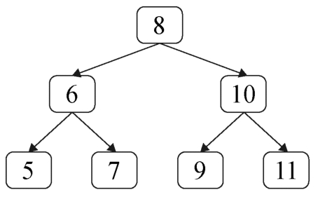

# 《剑指Offer：专项突破版》 - 队列部分 JavaScript 题解
《剑指Offer：专项突破版》是一个算法题集。该题单包含了程序员在准备面试过程中必备的数据结构与算法知识。具体包含：
- 数据结构：整数、数组、字符串、链表、栈、栈、队列、树、堆和前缀树。
- 算法：二分查找、排序、回溯法、动态规划和图搜索。 

本文来分享下树部分题的解法~

## 树介绍

## 题1 - 剑指 Offer II 047. 二叉树剪枝
> 题目：一棵二叉树的所有节点的值要么是0要么是1，请剪除该二叉树中所有节点的值全都是0的子树。例如，在剪除图（a）中二叉树中所有节点值都为0的子树之后的结果如图（b）所示。



[题的力扣地址](https://leetcode-cn.com/problems/pOCWxh/)

代码如下：

```js
```

## 题2 - 剑指 Offer II 048. 序列化与反序列化二叉树
> 题目：请设计一个算法将二叉树序列化成一个字符串，并能将该字符串反序列化出原来二叉树的算法。

[题的力扣地址](https://leetcode-cn.com/problems/h54YBf/)

代码如下：

```js
```

## 题3 - 剑指 Offer II 049. 从根节点到叶节点的路径数字之和
> 题目：在一棵二叉树中所有节点都在0～9的范围之内，从根节点到叶节点的路径表示一个数字。求二叉树中所有路径表示的数字之和。例如，下图的二叉树有3条从根节点到叶节点的路径，它们分别表示数字395、391和302，这3个数字之和是1088。



[题的力扣地址](https://leetcode-cn.com/problems/3Etpl5/)

代码如下：

```js
```

## 题4 - 剑指 Offer II 050. 向下的路径节点之和
> 题目：给定一棵二叉树和一个值sum，求二叉树中节点值之和等于sum的路径的数目。路径的定义为二叉树中顺着指向子节点的指针向下移动所经过的节点，但不一定从根节点开始，也不一定到叶节点结束。例如，在如图8.5所示中的二叉树中有两条路径的节点值之和等于8，其中，第1条路径从节点5开始经过节点2到达节点1，第2条路径从节点2开始到节点6。

[题的力扣地址](https://leetcode-cn.com/problems/6eUYwP/)

代码如下：

```js
```

## 题5 - 剑指 Offer II 051. 节点之和最大的路径
> 题目：在二叉树中将路径定义为顺着节点之间的连接从任意一个节点开始到达任意一个节点所经过的所有节点。路径中至少包含一个节点，不一定经过二叉树的根节点，也不一定经过叶节点。给定非空的一棵二叉树，请求出二叉树所有路径上节点值之和的最大值。例如，在如图8.6所示的二叉树中，从节点15开始经过节点20到达节点7的路径的节点值之和为42，是节点值之和最大的路径。

[题的力扣地址](https://leetcode-cn.com/problems/jC7MId/)

代码如下：

```js
```

## 题6 - 剑指 Offer II 052. 展平二叉搜索树
> 题目：给定一棵二叉搜索树，请调整节点的指针使每个节点都没有左子节点。调整之后的树看起来像一个链表，但仍然是二叉搜索树。例如，把图（a）中的二叉搜索树按照这个规则展平之后的结果如图（b）所示。



[题的力扣地址](https://leetcode-cn.com/problems/NYBBNL/)

代码如下：

```js
```

## 题7 - 剑指 Offer II 053. 二叉搜索树中的中序后继
> 题目：给定一棵二叉搜索树和它的一个节点p，请找出按中序遍历的顺序该节点p的下一个节点。假设二叉搜索树中节点的值都是唯一的。例如，在下图的二叉搜索树中，节点8的下一个节点是节点9，节点11的下一个节点是null。



[题的力扣地址](https://leetcode-cn.com/problems/P5rCT8/)

代码如下：

```js
```

## 题8 - 剑指 Offer II 054. 所有大于等于节点的值之和
> 题目：给定一棵二叉搜索树，请将它的每个节点的值替换成树中大于或等于该节点值的所有节点值之和。假设二叉搜索树中节点的值唯一。例如，输入如图（a）所示的二叉搜索树，由于有两个节点的值大于或等于6（即节点6和节点7），因此值为6节点的值替换成13，其他节点的值的替换过程与此类似，所有节点的值替换之后的结果如图（b）所示。



[题的力扣地址](https://leetcode-cn.com/problems/w6cpku/)

代码如下：

```js
```

## 题9 - 剑指 Offer II 055. 二叉搜索树迭代器
> 题目：请实现二叉搜索树的迭代器BSTIterator，它主要有如下3个函数。  
> ● 构造函数：输入二叉搜索树的根节点初始化该迭代器。  
> ● 函数next：返回二叉搜索树中下一个最小的节点的值。  
> ● 函数hasNext：返回二叉搜索树是否还有下一个节点。

[题的力扣地址](https://leetcode-cn.com/problems/kTOapQ/)

代码如下：

```js
```

## 题10 - 剑指 Offer II 056. 二叉搜索树中两个节点之和
> 题目：给定一棵二叉搜索树和一个值k，请判断该二叉搜索树中是否存在值之和等于k的两个节点。假设二叉搜索树中节点的值均唯一。例如，在如下图所示的二叉搜索树中，存在值之和等于12的两个节点（节点5和节点7），但不存在值之和为22的两个节点。



[题的力扣地址](https://leetcode-cn.com/problems/opLdQZ/)

代码如下：

```js
```

## 题11 - 剑指 Offer II 057. 值和下标之差都在给定的范围内
> 题目：给定一个整数数组nums和两个正数k、t，请判断是否存在两个不同的下标i和j满足i和j之差的绝对值不大于给定的k，并且两个数值nums[i]和nums[j]的差的绝对值不大于给定的t。

[题的力扣地址](https://leetcode-cn.com/problems/7WqeDu/)

代码如下：

```js
```

## 题12 - 剑指 Offer II 058. 日程表
> 题目：请实现一个类型MyCalendar用来记录自己的日程安排，该类型用方法book（int start，int end）在日程表中添加一个时间区域为[start，end）的事项（这是一个半开半闭区间）。如果[start，end）中之前没有安排其他事项，则成功添加该事项并返回true；否则，不能添加该事项，并返回false。

[题的力扣地址](https://leetcode-cn.com/problems/fi9suh/)

代码如下：

```js
```

## 相关阅读
* [《剑指Offer：专项突破版》 - 哈希表部分 JavaScript 题解](https://mp.weixin.qq.com/s/o57JvPCih3YT2cOxvPTSvw)
* [《剑指Offer：专项突破版》 - 链表部分 JavaScript 题解](https://mp.weixin.qq.com/s/IOA1cOa38c4DHcANcQgSKA)
* [《剑指Offer：专项突破版》 - 数组部分 JavaScript 题解](https://mp.weixin.qq.com/s/gU9gDo60IWbuBmoeX4a3gA)
* [《剑指Offer：专项突破版》 - 字符串部分 JavaScript 题解](https://mp.weixin.qq.com/s/aD4sEREM50EF294Mnt7xrw)
* [《剑指Offer：专项突破版》 - 整数部分 JavaScript 题解](https://mp.weixin.qq.com/s/E9wxw1ahtBeCAE_njmIr2Q)