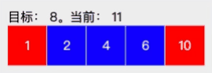

# 《剑指Offer：专项突破版》 - 数组部分 JavaScript 题解
《剑指Offer：专项突破版》是一个算法题集。该题单包含了程序员在准备面试过程中必备的数据结构与算法知识。具体包含：
- 数据结构：整数、数组、字符串、链表、哈希表、栈、队列、树、堆和前缀树。
- 算法：二分查找、排序、回溯法、动态规划和图搜索。 

本文来分享下数组部分题的解法~

## 题1 - 剑指 Offer II 006. 排序数组中两个数字之和
> 输入一个递增排序的数组和一个值k，请问如何在数组中找出两个和为k的数字并返回它们的下标？假设数组中存在且只存在一对符合条件的数字，同时一个数字不能使用两次。例如，输入数组[1，2，4，6，10]，k的值为8，数组中的数字2与6的和为8，它们的下标分别为1与3。

解法1: 列举所有的可能性。最容易想到的算法是用两个循环，遍历所有的可能性来找出目标数字。

解法2: 二分法。该解法的时间复杂度比解法1低。具体算法如下：
1. 固定第一个数。
2. 第二个数字下标设为可选区间的中点。可选区间的开始坐标是第一数的下标加1，结束坐标为数组结束。
   1. 如果和大于k，可选区间改成小的那一半，即：结束下标改为第二个数字的下标减1，开始下标不变。
   2. 如果和小于k，可选区间改成大的那一半，即：开始坐标改为第二个数字的下标加1，结束下标不变。
3. 不断重复上一步，如果找到这两个数，则程序结束。否则，直到可选区间为空后，进入下一步。
4. 第一个数的下标往右移动一位，重复第2步，直到找到为止。

解法3: 双指针法。该解法的时间复杂度度最低。具体算法如下：
1. 第一个数字的下标为数组开始，第二个数字的下标为数组结束。
2. 如果这两个数字的和大于k，则第二个数字的下标左移一位（和就会变小）。小于k，则第一个数字的指针右移一位（和就会变大）。
3. 重复这个过程，直到找到结果。

算法的示意如下：


代码实现如下：
```js
const twoSum = function (numbers, target) {
  let leftIndex = 0;
  let rightIndex = numbers.length - 1;

  while (left < right) {
    let left = numbers[leftIndex];
    let right = numbers[rightIndex];
    if (left + right === target) {
      return [leftIndex, rightIndex];
    }
    if (left + right > target) {
      rightIndex--;
    } else {
      leftIndex++;
    }
  }
};
```

[力扣地址](https://leetcode-cn.com/problems/kLl5u1/)

## 题2 - 剑指 Offer II 007. 数组中和为 0 的三个数
> 输入一个数组，如何找出数组中所有和为0的3个数字的三元组？需要注意的是，返回值中不得包含重复的三元组。例如，在数组[-1，0，1，2，-1，-4]中有两个三元组的和为0，它们分别是[-1，0，1]和[-1，-1，2]。

该题是上一题的升级版。将数组从小到大排序后，固定一个数字，找剩余数组中，和为 `0 - 固定数` 的两个数。此时，用上一题的方法求解。最后，将结果做个去重。

核心代码实现如下：
```js
const threeSum = function (nums) {
  const sortNums = [...nums]
  sortNums.sort((a, b) => a - b);

  const res = []
    for (let i = 0; i < sortNums.length - 2; i++) {
      const currNum = sortNums[i];
      const target = 0 - currNum;
      const twoSumRes = twoSum(sortNums.slice(i + 1), target);
      if (twoSumRes.length > 0) {
        res.push(...twoSumRes.map((item) => [currNum, ...item]));
      }
  }
  return uniq(res);
}

function twoSum(numbers, target) {
  const res = [];
  let leftIndex = 0;
  let rightIndex = numbers.length - 1;

  for (left < right) {
    let left = numbers[leftIndex];
    let right = numbers[rightIndex];
    if (left + right === target) {
      res.push([left, right]);
      leftIndex++;
      continue;
    }
    if (left + right > target) {
      rightIndex--;
    } else {
      leftIndex++;
    }
  }
  return res;
}
```

[力扣地址](https://leetcode-cn.com/problems/1fGaJU/)
## 题3 - 剑指 Offer II 008. 和大于等于 target 的最短子数组
> 输入一个正整数组成的数组和一个正整数k，请问数组中和大于或等于k的连续子数组的最短长度是多少？如果不存在所有数字之和大于或等于k的子数组，则返回0。例如，输入数组[5，1，4，3]，k的值为7，和大于或等于7的最短连续子数组是[4，3]，因此输出它的长度2。

该题本质就是找出所有满足条件的数组，挑最短的那个。如果用暴力的方式出找出所有可能性，时间复杂度太高了。

一种高效的解决方案是用双指针。用两个下标的移动来找出所有满足条件的情况。具体算法如下：
1. 开始位置的下标和结束位置下标都为0。
2. 如果开始下标和结束下标之间（包含开始和结束）的数字之和小于k，则结束下标右移一位（和会变大），直到和不小于k或结束下标为数组结束。
3. 开始下标右移一位（和会变小），直到和小于k或开始下标等于结束下标。
4. 重复第二和第三步，直到结束下标为数组结束。

代码实现如下：
```js
const minSubArrayLen = function (target, nums) {
  let startIndex = 0;
  let sum = 0;
  let count = Number.MAX_VALUE;

  for (let endIndex = 0; endIndex < nums.length; endIndex++) {
    sum += nums[endIndex];
    while (sum >= target && startIndex <= endIndex) {
      count = Math.min(count, endIndex - startIndex + 1);
      sum -= nums[startIndex];
      startIndex++; // 尝试少一个数字
    }
  }

  return count === Number.MAX_VALUE ? 0 : count;
};
```

[力扣地址](https://leetcode-cn.com/problems/2VG8Kg/)

## 题4 - 剑指 Offer II 009. 乘积小于 K 的子数组
> 输入一个由正整数组成的数组和一个正整数k，请问数组中有多少个数字乘积小于k的连续子数组？例如，输入数组[10，5，2，6]，k的值为100，有8个子数组的所有数字的乘积小于100，它们分别是[10]、[5]、[2]、[6]、[10，5]、[5，2]、[2，6]和[5，2，6]。

这题可以用上题一样的算法来解决。只是在细节上稍有不同。这边就不做赘述了。

代码实现如下：
```js
const numSubarrayProductLessThanK = function (nums, target) {
  let startIndex = 0;
  let res = 1;
  let count = 0;

  for (let endIndex = 0; endIndex < nums.length; endIndex++) {
    res *= nums[endIndex];
    while (res >= target && startIndex <= endIndex) {
      res /= nums[startIndex];
      startIndex++; // 尝试少一个数字
    }
    count += endIndex - startIndex + 1; // 1 到 n 的组合
  }

  return count;
};
```

[力扣地址](https://leetcode-cn.com/problems/ZVAVXX/)

## 题5 - 剑指 Offer II 010. 和为 k 的子数组
> 输入一个整数数组和一个整数k，请问数组中有多少个数字之和等于k的连续子数组？例如，输入数组[1，1，1]，k的值为2，有2个连续子数组之和等于2。

假设数组长度是n， 找到结束下标范围是0到n-1 满足条件的子数组，就找了所以的情况。

假设当前结束下标是 m，存在若干开始下标 x，满足和是 k。其中 `x < m`。有等式1：
```js
arr[x + 1] + arr[x + 2] + ... + ...arr[m] = k
```

假设，前 m 个数的和为 sum。即，有等式2:
```js
arr[0] + arr[1] + ... + arr[m] = sum

```

等式2减等式1，可得：
```js
arr[0] + arr[1] + ... + arr[x] = sum - k
```

有多少个这样下标x，就有多少可能的子数组。可以通过缓存数组从开始到某个数的和来减少重复计算。

代码实现如下：
```js
const subarraySum = function (nums, k) {
  let count = 0;
  let sum = 0;
  const sum = { 0: 1 }; // 和是0的值，初始化有一个。

  nums.forEach((num) => {
    sum += num;
    count += sum[sum - k] || 0;
    sumCache[sum] = (sumCache[sum] || 0) + 1;
  });

  return count;
};
```

[力扣地址](https://leetcode-cn.com/problems/QTMn0o/)

## 题6 - 剑指 Offer II 011. 0 和 1 个数相同的子数组
> 输入一个只包含0和1的数组，请问如何求0和1的个数相同的最长连续子数组的长度？例如，在数组[0，1，0]中有两个子数组包含相同个数的0和1，分别是[0，1]和[1，0]，它们的长度都是2，因此输出2。

将数组中的 0 都替换成 -1，则 0 和 1 的个数相同数组的和为0。本题就转化成了：找出最长的和是0的子数组的长度。可以用上题的算法来解本题。

代码实现如下：
```js
const findMaxLength = function (nums) {
  let count = 0;
  let sum = 0;
  const sumIndexCache = { 0: -1 }; // key 是 和， value 是下标

  nums.forEach((num, i) => {
    sum += num === 0 ? -1 : 1;
    if (sumIndexCache[sum] !== undefined) {
      count = Math.max(count, i - sumIndexCache[sum]);
    } else {
      sumIndexCache[sum] = i;
    }
  });

  return count;
};
```

[力扣地址](https://leetcode-cn.com/problems/A1NYOS/)

## 题7 - 剑指 Offer II 012. 左右两边子数组的和相等
> 输入一个整数数组，如果一个数字左边的子数组的数字之和等于右边的子数组的数字之和，那么返回该数字的下标。如果存在多个这样的数字，则返回最左边一个数字的下标。如果不存在这样的数字，则返回-1。例如，在数组[1，7，3，6，2，9]中，下标为3的数字（值为6）的左边3个数字1、7、3的和与右边两个数字2和9的和相等，都是11，因此正确的输出值是3。

前 n 个数的和等于前 n -1 个数的和加上第 n 的数的和。缓存之前求的和，可以避免重复计算，从而降低算法的时间复杂度。

代码实现如下：
```js
const pivotIndex = function (nums) {
  const sumCache = []; // 前 n 个，不包含 n
  let sumTotal = 0;
  nums.forEach((num) => {
    sumCache.push(sumTotal);
    sumTotal += num;
  });

  for (let i = 0; i <= nums.length - 2; i++) {
    if (sumCache[i] === sumTotal - sumCache[i + 1]) {
      return i;
    }
  }
  if (sumCache[nums.length - 1] === 0) {
    return nums.length - 1;
  }
  return -1;
};
```

[力扣地址](https://leetcode-cn.com/problems/tvdfij/)

## 题8 - 剑指 Offer II 013. 二维子矩阵的和
> 输入一个二维矩阵，如何计算给定左上角坐标和右下角坐标的子矩阵的数字之和？对于同一个二维矩阵，计算子矩阵的数字之和的函数可能由于输入不同的坐标而被反复调用多次。例如，输入图2.1中的二维矩阵，以及左上角坐标为（2，1）和右下角坐标为（4，3）的子矩阵，该函数输出8。

通过观察，任意的 左上角坐标 和 右下角坐标 的子矩阵的数字之和 可以转化为左上角坐标是（0，0）的几个矩阵运算：
```js
res = sum[row2][col2] -
    (row1 > 0 ? sum[row1 - 1][col2] : 0) -
    (col1 > 0 ? sum[row2][col1 - 1] : 0) +
    (row1 > 0 && col1 > 0 ? sum[row1 - 1][col1 - 1] : 0)
```

其中：
* row1，col1 为 左上角坐标。row2，col2 为 右下角坐标。
* sum[x][y] 为 左上角坐标是 （0，0）右下角坐标为 x，y的矩阵的和。

因此，缓存所有的左上角坐标是（0，0）的子矩阵的和，就可以快速的算出任意子矩阵的和。

代码实现如下：
```js
const NumMatrix = function (matrix) {
  const sum = [];
  for (let row = 0; row < matrix.length; row++) {
    sum[row] = [];
    if (row === 0) {
      let rowSum = 0;
      for (let col = 0; col < matrix[0].length; col++) {
        rowSum += matrix[0][col]
        sum[0][col] = rowSum;
      }
      continue;
    }
    let rowSum = 0;
    for (let col = 0; col < matrix[0].length; col++) {
      rowSum += matrix[row][col];
      sum[row][col] = sum[row - 1][col] + rowSum;
    }
  }
  this.sum = sum;
};

NumMatrix.prototype.sumRegion = function (row1, col1, row2, col2) {
  const sum = this.sum;
  return (
    sum[row2][col2] -
    (row1 > 0 ? sum[row1 - 1][col2] : 0) -
    (col1 > 0 ? sum[row2][col1 - 1] : 0) +
    (row1 > 0 && col1 > 0 ? sum[row1 - 1][col1 - 1] : 0)
  );
};
```

[力扣地址](https://leetcode-cn.com/problems/O4NDxx/)

## 总结
解数组的算法题，在某些场景下，用双指针和缓存的技巧可以降低算法的时间复杂度。

用双指针，可以减少遍历数组的次数。难点在确定开始，结束指针的位置，移动规则，做到不遗漏情况。

用缓存可以减少重复计算。多用在求和，求乘等。关键是发现任意输入和缓存值的映射关系。

## 相关推荐
* [《剑指Offer：专项突破版》 - 整数部分 JavaScript 题解](https://mp.weixin.qq.com/s/E9wxw1ahtBeCAE_njmIr2Q)