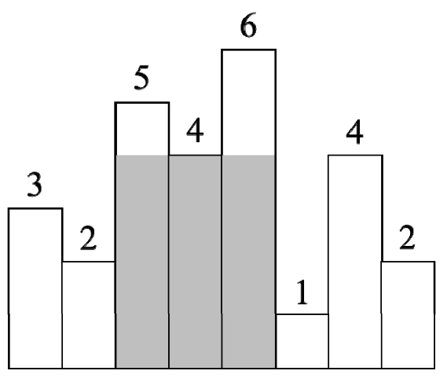
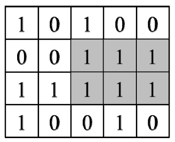

# 《剑指Offer：专项突破版》 - 栈部分 JavaScript 题解
《剑指Offer：专项突破版》是一个算法题集。该题单包含了程序员在准备面试过程中必备的数据结构与算法知识。具体包含：
- 数据结构：整数、数组、字符串、链表、栈、栈、队列、树、堆和前缀树。
- 算法：二分查找、排序、回溯法、动态规划和图搜索。 

本文来分享下栈部分题的解法~

## 栈介绍

## 题1 - 剑指 Offer II 036. 后缀表达式
> 题目：后缀表达式是一种算术表达式，它的操作符在操作数的后面。输入一个用字符串数组表示的后缀表达式，请输出该后缀表达式的计算结果。假设输入的一定是有效的后缀表达式。例如，后缀表达式["2"，"1"，"3"，"*"，"+"]对应的算术表达式是“2+1*3”，因此输出它的计算结果5。

[题的力扣地址](https://leetcode-cn.com/problems/8Zf90G/)

代码如下：

```js
```

## 题2 - 剑指 Offer II 037. 小行星碰撞
> 题目：输入一个表示小行星的数组，数组中每个数字的绝对值表示小行星的大小，数字的正负号表示小行星运动的方向，正号表示向右飞行，负号表示向左飞行。如果两颗小行星相撞，那么体积较小的小行星将会爆炸最终消失，体积较大的小行星不受影响。如果相撞的两颗小行星大小相同，那么它们都会爆炸消失。飞行方向相同的小行星永远不会相撞。求最终剩下的小行星。例如，有6颗小行星[4，5，-6，4，8，-5]，如图6.2所示（箭头表示飞行的方向），它们相撞之后最终剩下3颗小行星[-6，4，8]。

[题的力扣地址](https://leetcode-cn.com/problems/XagZNi/)

代码如下：

```js
```

## 题3 - 剑指 Offer II 038. 每日温度
> 题目：输入一个数组，它的每个数字是某天的温度。请计算每天需要等几天才会出现更高的温度。例如，如果输入数组[35，31，33，36，34]，那么输出为[3，1，1，0，0]。由于第1天的温度是35℃，要等3天才会出现更高的温度36℃，因此对应的输出为3。第4天的温度是36℃，后面没有更高的温度，它对应的输出是0。其他的以此类推。

[题的力扣地址](https://leetcode-cn.com/problems/iIQa4I/)

代码如下：

```js
```

## 题4 - 剑指 Offer II 039. 直方图最大矩形面积
> 题目：直方图是由排列在同一基线上的相邻柱子组成的图形。输入一个由非负数组成的数组，数组中的数字是直方图中柱子的高。求直方图中最大矩形面积。假设直方图中柱子的宽都为1。例如，输入数组[3，2，5，4，6，1，4，2]，其对应的直方图如下图所示，该直方图中最大矩形面积为12，如阴影部分所示。



[题的力扣地址](https://leetcode-cn.com/problems/0ynMMM/)

代码如下：

```js
```

## 题5 - 剑指 Offer II 040. 矩阵中最大的矩形
> 题目：请在一个由0、1组成的矩阵中找出最大的只包含1的矩形并输出它的面积。例如，在下图的矩阵中，最大的只包含1的矩阵如阴影部分所示，它的面积是6。



[题的力扣地址](https://leetcode-cn.com/problems/PLYXKQ/)

代码如下：

```js
```


## 相关阅读
* [《剑指Offer：专项突破版》 - 哈希表部分 JavaScript 题解]()
* [《剑指Offer：专项突破版》 - 链表部分 JavaScript 题解](https://mp.weixin.qq.com/s/IOA1cOa38c4DHcANcQgSKA)
* [《剑指Offer：专项突破版》 - 数组部分 JavaScript 题解](https://mp.weixin.qq.com/s/gU9gDo60IWbuBmoeX4a3gA)
* [《剑指Offer：专项突破版》 - 字符串部分 JavaScript 题解](https://mp.weixin.qq.com/s/aD4sEREM50EF294Mnt7xrw)
* [《剑指Offer：专项突破版》 - 整数部分 JavaScript 题解](https://mp.weixin.qq.com/s/E9wxw1ahtBeCAE_njmIr2Q)